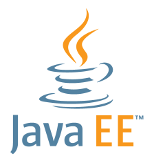

# MP07 Grup 2T
# Fitxa Informativa

Al segon curs de DAW cursareu les següents Unitats Formatives del Mòdul Professional 07 - Desenvolupament Web d'entorn servidor:

1. UF1 - Desenvolupament web en entorn servidor
2. UF2 - Generació dinàmica de pàgines web
3. UF3 - Accés a dades
4. UF4 - Serveis web

Aquests quatre Unitats Formatives (UF, per abreujar), són una continuació de les UF d'M032, aplicades al desenvolupament web en entorn servidor.

## Prerequisits i recomanacions

- Per a poder cursar amb èxit aquestes quatre unitats formatives d'M072, és recomanable haver superat el Mòdul Professional MP03 - Programació, i en particular és requeriment (o tenir els coneixements equivalents a):
    * haver superat les UF4 i UF5 d'M032 abans de començar M072
    * haver superat la UF6 d'M032, i el mòdul M021 (Bases de dades) abans de començar les UF3 i UF4 d'M072

## Metodologia

- Es proposaran una col·lecció d'activitats, algunes de les quals seran complementàries i d'altres obligatòries i avaluables.
- Les activitats són eminentment pràctiques (**s'apren fent**).
- El professor/a farà de mentor i us anirà guiant durant la realització de les activitats, i resolent els dubtes que els alumnes vulguin plantejar.
- A cada UF el professorat realitzarà una o més _MasterClass_ per a explicar conceptes i posar exemples pràctics.
- Al final de cada UF hi haurà un exàmen pràctic.

## Criteris d'avaluació

- S'avaluarà l'actitud, interès i participació de l'alumne.
- S'avaluaran les diferents activitats obligatòries i avaluables, que obtindran una qualificació i una retralimentació.
- S'avaluaran els exàmens, que obindran una qualificació i una retroalimentació.
- Si un alumne no lliura alguna de les activitats obligatòries, o no es presenta a l'examen, obtindrà una qualificació de NP (No Presentat).
- Un NP en primera convocatòria (avaluació continuada durant el curs) **sí** gasta convocatòria.
- Un NP en segona convocatòria (avaluació extraordinària al Juny) **no** gasta convocatòria.
- Cada activitat obligatòria i avaluable **té una data límit de lliurament**: 

    * Si l'alumne no lliura l'activitat abans del final del dia de la data límit, disposarà encara de **7 dies naturals** de gràcia a comptar tot seguit per a lliurar l'activitat, però **la qualificació màxima que podrà obtenir serà 5**. 
    * Passats aquests 7 dies de gràcia, qualsevol lliurament realitzat amb posterioritat només **s'avaluarà en segona convocatòria**.

- Per a poder presentar-se a segona convocatòria, és necessari haver lliurat prèviament a la data d'aquest examen, totes les activitats avaluables corresponents a la UF o UFs per les que l'alumne es presenta.

- Faltes d'assistència de més d'un 20% del total d'hores d'una UF té la conseqüència que l'alumne **no** podrà superar la UF en convocatòria ordinària. Si ho desitja, l'alumne es podrà presentar en segona convocatòria al Juny (cal lliurar igualment totes les activitats avaluables).

## Criteris de qualificació

- Per a cada UF l'alumne obtindrà una qualificació entre 0 i 10, si lliura **totes** les activitats obligatòries i **es presenta a l'examen** (encara que no el lliuri).

- Cada activitat avaluable, i també l'examen, tindrà **3 nivells**:

    * Nivell 1: la resolució correcte implica una qualificació de 5.
    * Nivell 2: la resolució correcte implica una qualificació màxima de 7.5.
    * Nivell 3: la resolució correcte implica una qualificació màxima de 10.

- El conjunt de les activitats avaluables representa el 50 % de la qualificació final de l'UF, tant en primera com en segona convocatòria.

- La qualificació obtinguda a l'examen representa el 50% de la qualificació final de la UF, tant en primera com en segona convocatòria.

- Per a poder superar la UF, és obligatori haver obtingut com a mínim un 5 en cada activitat avaluable.

- Per a poder superar la UF, és obligatori haver obtingut com a mínim un 5 a l'examen.

## Eines i recursos

Les eines i recursos estaran disponibles a l'aula virtual de Moodle del centre, a l'entorn de treball en línia i a github.

## Comunicació asíncrona

La comunicació entre alumnat i professorat serà prioritàriament presencial a classe. De forma **complementària** es pot fer servir el _Fòrum de debat_ inclòs a l'aula virtual de Moodle.

## Llenguatge de programació i tecnologies

El llenguatge de programació principal que usem és 
[JAVA](https://ca.wikipedia.org/wiki/Java_(llenguatge_de_programaci%C3%B3))

Tecnologies:

 

  

 

